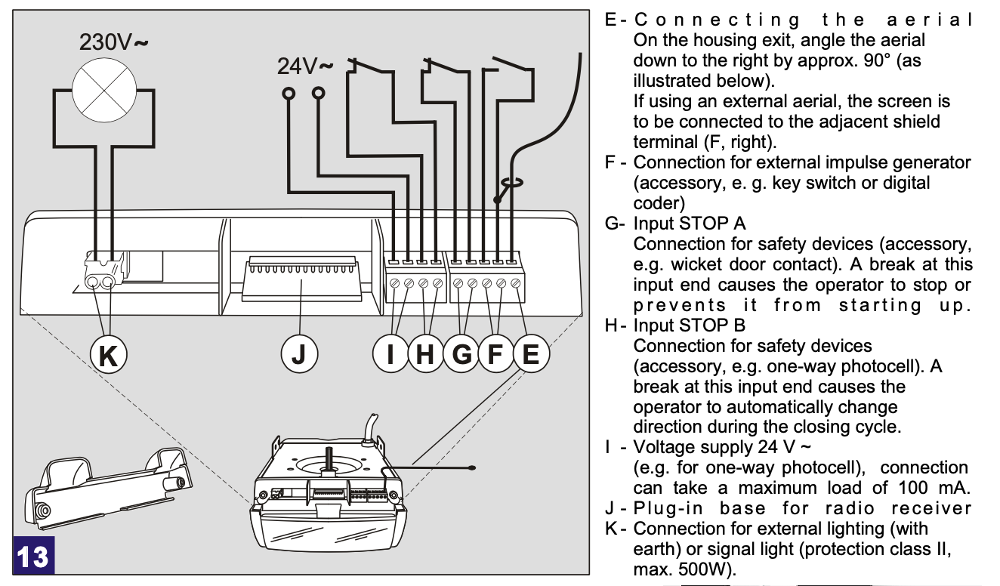
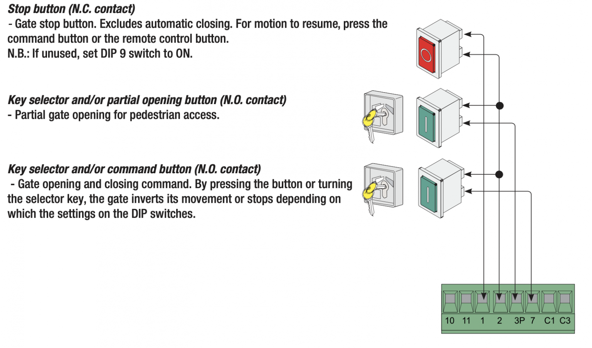
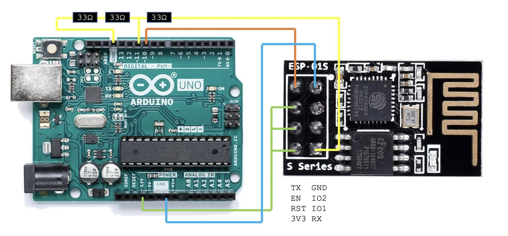
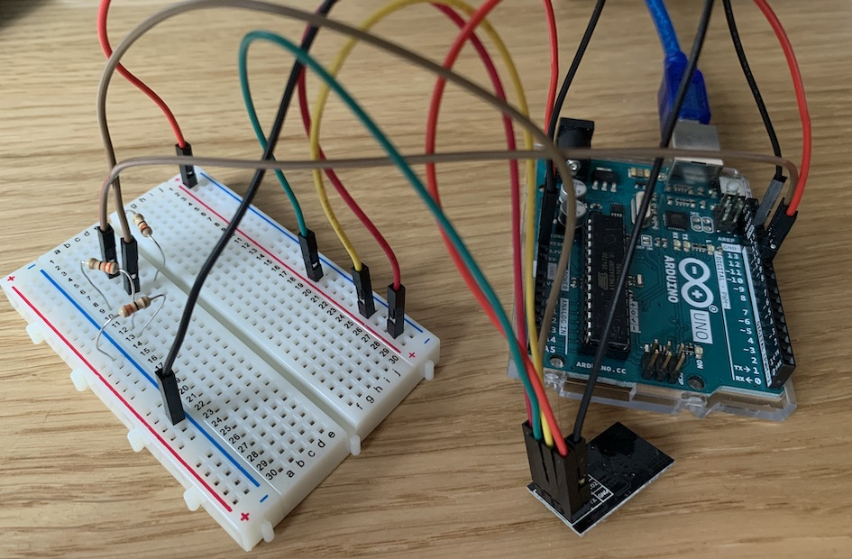
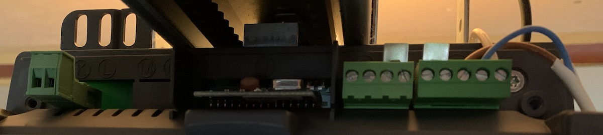
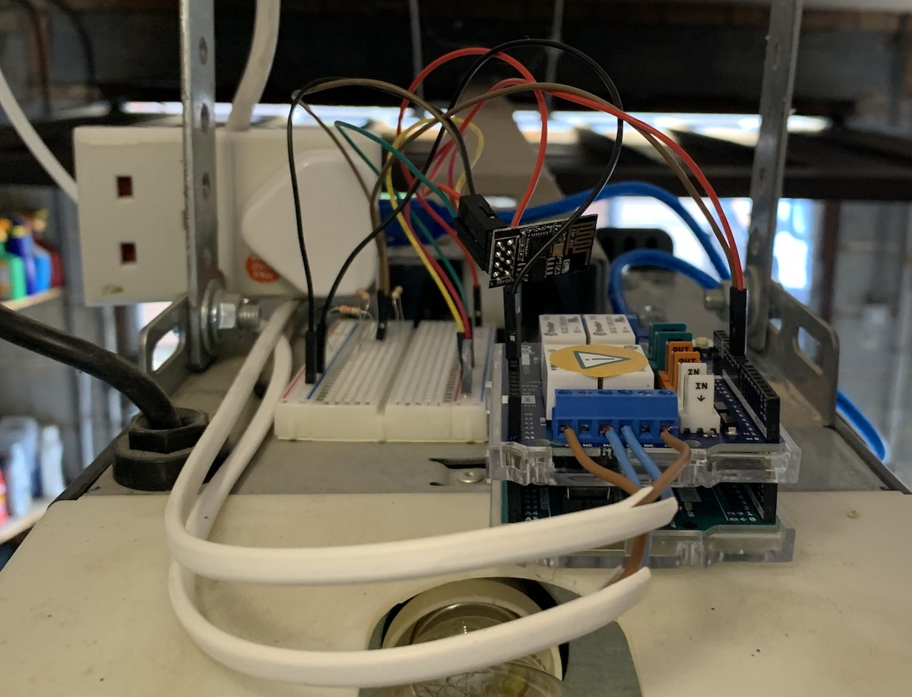

# Garage Door Opener

[TOC]

I have an electric garage door. it has a remote control to open it. very 90s. I considered building a Raspberry PI based SDR to replace it, but apparently the remote control makes use of an AES chip to prevent folk grabbing and repeating the radio code. Very 00s. I say ‘apparently’, I still want to look into this for myself when I find the time, but for now it’s plan B.

Plan B was to buy a [Smartgate](https://ismartgate.com/) opener which links to Siri , but I felt that >£250 was a lot to spend on a microcontroller and a relay. I’m sure there’s lots of value added stuff in here, but I feel there should be a more basic solution.

Which brings us to plan C, build one myself. For some reason Raspberry Pi Zero W’s are out of stock everywhere, so this give me the perfect excuse to look into Arduinos. After far too much googling I settled on an [Arduino Uno Rev 3](https://store.arduino.cc/arduino-uno-rev3 ) because, as Arduino themselves say:

> The **Arduino UNO** is the best board to get started with electronics and coding. If this is your first experience tinkering with the platform, the UNO is the most robust board you can start playing with.


Usefully, Arduino also make a 4 relay shield which works work the Uno.

> The **Arduino 4 Relays Shield** is a solution for driving high power loads that cannot be controlled by Arduino’s digital IOs, due to the current and voltage limits of the controller. The Shield features four relays, each relay provides 2 pole changeover contacts (NO and NC).


All very useful. But how did I know I needed a relay?

## 24V Relay

The garage door opener is a Novoferm Novomatic 553. I got a copy of the [installation manual]( https://www.teknuw.com/wordpress/wp-content/uploads/2011/02/Novoferm_Novomatic_403_553.pdf) which has a couple of useful references:



I’m guessing that this means the two ports F are a 24V switch which can be used to trigger an opening/closing event as if the remote has just been used. Reassuringly, the [iSmartGate compatibility checker](https://ismartgate.com/compatibility-checker/) confirms that these are the ports I should be wiring to.

If it’s that easy, I wander if this is a standard? In an ideal world I’d like the automation system to also open the front gate. iSmartGate can open up to 3 devices and all with the same interface.

The [Came BX-78 gate manual]( https://docs.came.com/pdf/FA01123-EN.pdf?1529506419) has a simliar wiring diagram suggesting I should wire to ports 2 & 7, which again is backed up by the iSmartGate compatibility checker.



With the Arduino 4 relay shield I can operate both garage doors and the front gate, assuming that they really do switch 24V. Excellent 🙂

## WiFi

I’ve forgotten something. The Uno doesn’t have WiFi. Many of the Arduino boards do, but it is so ubiquitous that I failed to check. The boards with WiFi are double the price. 

However, all is not lost, it is possible to connect a WiFi board to the Uno. Enter the ESP8266. After many hours of research I settled on this component as it only requires 2 GPIO ports from the Uno. This is important as many of them will be required to drive the relays.


The net step is learning how it works. For this I used thew following three resources:

- https://medium.com/@cgrant/using-the-esp8266-wifi-module-with-arduino-uno-publishing-to-thingspeak-99fc77122e82
- https://create.arduino.cc/projecthub/Niv_the_anonymous/esp8266-beginner-tutorial-project-6414c8
- https://www.instructables.com/id/Getting-Started-With-the-ESP8266-ESP-01/

They all present slightly contradictory information but agree on enough to give a good pointer on how to get started. As a first step we use the Uno as a bridge to get Serial access to the ESP8266, but we don’t want the Uno to boot up. This can be achieved by grounding its reset pin. 

The rest of the wiring is as follows:

```bash
Esp8266 | Arduino 
-----------------
     RX | RX 
     TX | TX 
    GND | GND
    VCC | 3.3v 
  CH_PD | 3.3v 
  RESET | None
 GPIO 0 | None 
 GPIO 2 | None
```

Note that the RX is connected to RX, not TX. This is because we’re passing the signals on rather than back and forth. 

VCC and GND are self explanatory. CH_PD needs to be brought high to enable the chip. Separately RESET should be taken high for completeness but is apparently fine floating for now.

This is how it should look in theory and in practice:


Connecting the Uno to a computer, we can then use the Arduino IDE built in serial monitor (Tools->Serial Monitor) once the board is powered.

The settings **Both NL & CR** and **115200** baud seems to work and allows us to issue AT commands from the terminal.

```bash
AT # Test

OK
----
AT+CIPSTATUS # Connection Status
STATUS:5

OK
----
AT+CIFSR	# Get local IP address
+CIFSR:APIP,"192.168.4.1"
+CIFSR:APMAC,"de:4f:22:75:4e:ae"

OK
----
AT+GMR # Get Version number

AT version:1.1.0.0(May 11 2016 18:09:56)
SDK version:1.5.4(baaeaebb)
compile time:May 20 2016 15:08:19
OK
```

I used three resources to understand the relevant AT commands:

- https://www.espressif.com/sites/default/files/documentation/4a-esp8266_at_instruction_set_en.pdf
- https://www.instructables.com/id/Getting-Started-With-the-ESP8266-ESP-01/
- http://www.pridopia.co.uk/pi-doc/ESP8266ATCommandsSet.pdf

The instructables guide suggested a sequence of commands that worked pretty well to get the board joined on the local WiFi.

```bash
AT+CWMODE=1  # Set Mode 1 = station, 2=AP, 3=Both

OK
----
AT+CWMODE? # Confirm status

+CWMODE:1

OK
----
AT+CIFSR # Check current connection

+CIFSR:STAIP,"0.0.0.0"
+CIFSR:STAMAC,"dc:4f:22:75:4e:ae"

OK
----
AT+CWLAP # Scan for APs

+CWLAP:(5,"Virgin Media",-91,"5a:d3:43:4f:2f:69",1,-26,0)
+CWLAP:(3,"Karpol",-40,"18:e8:29:54:73:9d",6,3,0)
+CWLAP:(3,"Karpol",-71,"18:e8:29:54:6e:62",6,3,0)
+CWLAP:(3,"🐿",-41,"1a:e8:29:54:73:9d",6,1,0)
+CWLAP:(3,"Karpol",-71,"18:e8:29:54:6f:61",11,-7,0)
+CWLAP:(3,"🐿",-72,"1a:e8:29:54:6f:61",11,-7,0)
----
AT+CWJAP="<NETWORK>","<PASSWORD>" # Connect to AP

WIFI CONNECTED
WIFI GOT IP

OK
----
AT+CIFSR # Check Connection again

+CIFSR:STAIP,"10.0.42.50"
+CIFSR:STAMAC,"dc:4f:22:75:4e:ae"

OK
```

To now run the ESP01 as a web server required a couple more commands:

```bash
AT+CIPMUX=1 # Enable multiple connections

OK
----
AT+CIPSERVER=1,80 # open server mode, port 80

OK
```

At this point we can connect a browser (not Safari) to the board to open a connection, send some data, then close the connection to complete the process and display the text in the browser.

```bash
0,CONNECT
# header received from browser
+IPD,0,436:GET / HTTP/1.1
Host: 10.0.42.30
Connection: keep-alive
Upgrade-Insecure-Requests: 1
User-Agent: Mozilla/5.0 (Macintosh; Intel Mac OS X 10_15_3) AppleWebKit/537.36 (KHTML, like Gecko) Chrome/80.0.3987.149 Safari/537.36
Accept: text/html,application/xhtml+xml,application/xml;q=0.9,image/webp,image/apng,*/*;q=0.8,application/signed-exchange;v=b3;q=0.9
Accept-Encoding: gzip, deflate
Accept-Language: en-GB,en-US;q=0.9,en;q=0.8

----
AT+CIPSEND=0,5 # request to send 5 bytes

OK
> HELLO #message to send

Recv 5 bytes

SEND OK
----
AT+CIPCLOSE=0 # close connectionk to complete server

0,CLOSED
```

To confirm connection in the opposite direction, telnet can also connect to port 80 and the entered text is displayed in the AT terminal:

```bash
0,CONNECT

+IPD,0,4:⸮⸮
+IPD,0,16:xterm-256color⸮⸮
+IPD,0,3:⸮⸮
+IPD,0,6:3⸮⸮
+IPD,0,1:c
+IPD,0,1:h
+IPD,0,1:e
+IPD,0,1:e
+IPD,0,1:s
+IPD,0,1:e
```

Running the ESP01 with AT commands is a great start, but for prolonged use we want to manage the WiFI board with C code from the Arduino. 

The first problem is that the Arduino serial bus is used by the Arduino to send debug information to the terminal – it cannot also be used to talk to the ESP8266. Instead I need to use a software serial bus with some spare GPIO pins. Fortunately Arduino have already produced a [library]( https://www.arduino.cc/en/Reference/softwareSerial) that allows you to run a software serial over 2 GPIO lines. Using it is very similar to the hardware serial with the extra requirement to include the software library and specify the RX & TX GPIO ports.

```c
#include <SoftwareSerial.h>
SoftwareSerial mySerial(10, 11); // RX, TX
```

Job done!

## Power Levels

Job not done. The Arduino GPIO runs at 5V, but the ESP8266 operates at 3.3V. I didn’t realise this at first and nothing appears to have broken when I connected directly, but long term this is not a reliable solution.

Also the GPIO on Arduino is 5v but the ESP expects 3V. Using it incorrectly will lead to a burn out eventually. [This site](http://onlineshouter.com/top-5-ways-wire-esp8266-module-arduino-uno-board/) talks about power issues specifically with the ESP8266, suggesting using voltage regulators. Alternatively [this site](https://learn.sparkfun.com/tutorials/voltage-dividers/all.) explains more about voltage regulators. I happen to have a packet of 33Ω resistors so will use 3 of those to divide the 5V down to 3.3V. 

Putting these two changes together gives the following diagrams and another picture of how it looks on a breadboard.

```bash
Esp8266 | Arduino 
-----------------
     TX | GPIO10 
     RX | GPIO11
    GND | GND
    VCC | 3.3v 
  CH_PD | 3.3v 
  RESET | None
 GPIO 0 | None 
 GPIO 2 | None
```

Note that grounding the reset line on the Arduino is no longer required. Also note that RX is now connected to TX and vice versa. This is because the link is reciprocal rather than pass through.





I know, my breadboard wiring is atrocious.

## Syncing

To test if this works I can use a simple serial proxy to pass commands between the Uno serial and the ESP software serial.

```c
#include <SoftwareSerial.h>
SoftwareSerial mySerial(10, 11); // RX, TX

void setup()
{
  Serial.begin(115200); # Open Uno serial
  while (!Serial) ;     # Wait for connection

  mySerial.begin(115200);
  while (!myserial) ;     # Wait for connection
}

void loop()
{
  if (mySerial.available())
    Serial.write(mySerial.read());
  if (Serial.available())
    mySerial.write(Serial.read());
}
```

It works! Nearly. AT commands reach the ESP perfectly fine but the response is noisy and increasingly garbled as time goes on. Reading around suggests that the software serial isn’t very stable at high baud rates, and 115200 is quite high. I need to turn everything down to 9600 baud. This is easy in the software , I just need to change the baud rate during initialisation. 

To change the baud rate of the ESP8266 requires an AT command which seems to vary by firmware version. For my module the following command worked:

```bash
AT+UART_DEF=9600,8,1,0,0
```

This permanently changes the baud rate of the ESP. Although it shouldn’t be necessary, changing the baud rate of the hardware serial also seemed to help stabilise the connection.

## Coding

I now have enough hardware to try to talk to the Uno via TCP. 

The first step will be to write some code to manage and test the WiFi connection on the ESP from the Uno. The following code shows how this is done during startup. Notice that this code does not set the baud rate or the access point SSID and password. These values seem to be be retained by the ESP during power down so there is no point setting again in test code. If I want the finished system to be more stable I could add some code to check the IP address and resubmit the AP request if it is not connected.

```c
// Software Serial to communicate with ESP8266
#include <SoftwareSerial.h>
#define RX 10
#define TX 11
SoftwareSerial esp(RX, TX);

// function prootype with optional parameter
void sendtoesp(String command, int delay, int silent=0);

//setup turns on the serial busses and enables wifi
void setup() {
  initHardwareSerial();
  initSoftwareSerial();
  WiFiInit();
}

// onboard serial for debugging
void initHardwareSerial() {
  Serial.begin(9600);
  while (!Serial) ;
  Serial.println("Uno Serial [OK]");
}

// software serial for ESP interface
void initSoftwareSerial() {
  Serial.print("ESP Serial");
  esp.begin(9600);
  long int time=millis();
  while ((time+10000)>millis()) {
    if(Serial) {
      Serial.println(" [OK]");
      return;
    }
  }
  error();
}

// request ESP join WIFI and run as server
void WiFiInit() {
  Serial.println("WiFi INIT");
  // TODO: Init from scratch

  // Assume it already has the correct settings
  sendtoesp("AT+CWMODE=1",1000); // Join existing AP
  sendtoesp("AT+CIPCLOSE=0",1000,1); // close existing connections
  sendtoesp("AT+CIPMUX=1",1000); // enable multiple connections
  sendtoesp("AT+CIPSERVER=1,80",5000); // open server on port 80 
}


// Send an AT command to the ESP serial and wait for a response
void sendtoesp(String command,int delay,int silent) {
  esp.println(command);
  String response = "";
  Serial.print(command);
  long int time=millis();
  while ((time+delay)>millis()) {
    if(esp.available()) {
      char c = esp.read();
      response+=c;
      if(response.indexOf("OK")>=0) {
        Serial.println(" [OK]");
        return;
      }
    }
  }
  if(silent==1) {
    Serial.println("[SHRUG]");
  } else {
    error();
  }
}

// If an AT command fails, stop running
void error() {
  Serial.println(" [ERROR]");
  Serial.println("[HALT]");
  while(1) ;
}

// Test for IP address assignment
void getIP() {
  String response = "";
  esp.println("AT+CIFSR");
  long int time=millis();
  while ((time+1000)>millis()) {
    while(esp.available()) {
      char c = esp.read();
      response+=c;
    }
  }
  Serial.print("IP ADDR: ");
  int a = response.indexOf("STAIP") + 7;
  String ip= response.substring(a,response.indexOf("\"",a));
  Serial.println(ip);
}
```

As we saw in the previous experiment, any HTTP requests sent to the IP address of the ESP appears on the serial. I need to write some code for the main loop to detect that connection and extract commands in whatever format I choose to use.

```c
void loop() {
  String readstring;
  while(esp.available()) { // wait for some input from the ESP
    delay(3);
    char c =esp.read();
    readstring+=c;
  }
  if(readstring.length()>0) {
    if(readstring.indexOf("RELAY")>=0) { // If it contains the word RELAY
      int i=readstring.indexOf("RELAY");
      String q=readstring.substring(i+5,i+6);  // then get the relay value
      Serial.print("activate RELAY ");
      Serial.println(q);
      sendtoesp("AT+CIPSEND=0,2",1000);	// and send a session close
      sendtoesp("OK",1000);
      sendtoesp("AT+CIPCLOSE=0",1000);  
      readstring="";
    } else if (readstring.indexOf("IPD")>=0) { // if a different request
      sendtoesp("AT+CIPSEND=0,6",1000);	       // just send a session close
      sendtoesp("GOAWAY",1000);
      sendtoesp("AT+CIPCLOSE=0",1000);
      readstring="";
    }
  }
}
```

This code looks for the word “RELAY” in the incoming request, e.g. in a URL request. It then needs to send a response to the caller to close the connection once the message has been extracted.

With this running we can connect to the hardware over TCP with the *curl* command, and monitor the results with the serial connection.

```bash
> curl 10.0.42.171/RELAY1
OK%
> curl 10.0.42.171/RELAY2
OK%
> curl 10.0.42.171/OTHER
GOAWAY%
Uno Serial [OK]
ESP Serial [OK]
WiFi INIT
AT+CWMODE=1 [OK]
AT+CIPCLOSE=0[SHRUG]
AT+CIPMUX=1 [OK]
AT+CIPSERVER=1,80 [OK]
IP ADDR: 10.0.42.171
activate RELAY 1
AT+CIPSEND=0,2 [OK]
OK [OK]
AT+CIPCLOSE=0 [OK]
activate RELAY 2
AT+CIPSEND=0,2 [OK]
OK [OK]
AT+CIPCLOSE=0 [OK]
AT+CIPSEND=0,6 [OK]
GOAWAY [OK]
AT+CIPCLOSE=0 [OK]
```

This shows how it is indeed possible to send RELAY commands to the Arduino over WiFi from a terminal or browser.

The code is more complex than required as it includes various debug routines and other elements to improve the flow. It is possible to condense the code down to the essential parts which is a lot more compact, and still works almost as well.

```c
#include <SoftwareSerial.h>
SoftwareSerial esp(10,11);
void setup() {
  Serial.begin(9600);  
  esp.begin(9600);
  esp.println("AT+CIPMUX=1"); 
  esp.println("AT+CIPSERVER=1,80");  
  Serial.println("Ready");
}
void loop() {
  String readstring;
  while(esp.available()) {
    delay(3);
    readstring+=(char)esp.read();
  }
  if(readstring.length()>0) {
    if(readstring.indexOf("RELAY")>=0) {
      int i=readstring.indexOf("RELAY");
      Serial.println(readstring.substring(i+5,i+6));
      esp.println("AT+CIPCLOSE=0");  
      readstring="";
    } else if (readstring.indexOf("IPD")>=0) {
      esp.println("AT+CIPCLOSE=0");
      readstring="";
    }
  }
}
```

## Relay Shield

Having spent enough effort learning about ESP8266 WiFi chips, it’s time to look at the 4 Relay Shield instead.


This has been designed to sit on top of the Arduino Uno with all the pins aligning perfectly, so much easier to wire up that the ESP. It takes its power from the board below and uses some of the GPIO for its communications.

Turning relays on and off is simple, they just mirror 4 of the GPIO pins. For a sample program the correct pins need to be enabled, then turned on and off to test. The documentation shows how these match up:

| GPIO pin | Relay |
| :------- | :---- |
| 4        | 1     |
| 7        | 2     |
| 8        | 3     |
| 12       | 4     |

```c
void setup() { // initialize the digital pins as an output
  pinMode(4, OUTPUT);  
  pinMode(7, OUTPUT); 
  pinMode(8, OUTPUT); 
  pinMode(12, OUTPUT);
}

void loop() {
  digitalWrite(4, HIGH); // switch each of the relays on in turn
  delay(1000);
  digitalWrite(7, HIGH);
  delay(1000);
  digitalWrite(8, HIGH);
  delay(1000);
  digitalWrite(12, HIGH);
  delay(1000);
  digitalWrite(4, LOW); // then switch them off them again
  delay(1000); 
  digitalWrite(7, LOW); 
  delay(1000);
  digitalWrite(8, LOW); 
  delay(1000); 
  digitalWrite(12, LOW);
  delay(1000); 
}
```

It really is that simple.

To add the relay to the existing code the pin initialisation can be moved to using an array in the setup function:

```c
int RelayPins[] = {4, 7, 8, 12};

// Setup function to set GPIO pins to output for comms to relay
void initRelay() {
    for (int p = 0; p < 4; p++) {
    pinMode(RelayPins[p], OUTPUT);
  }
}
```

To control the relay the following function is added and called from with the main loop once the relay number has been received over WiFi:

```c
void triggerRelay(String s) {
  int i = s.toInt();
  Serial.println(i);
  if(i==0) {
    Serial.print("invalid command: ");
    Serial.println(s);
  }
  if(i>0 && i<=4) {
    digitalWrite(RelayPins[i-1],HIGH);
    delay(2000);
    digitalWrite(RelayPins[i-1],LOW);    
  } else {
    Serial.print("invalid relay: ");
    Serial.println(i);
  }
}
```

## Integration

Merging the two components of relays and WiFi gives a viable solution. Fortunately the GPIO pins used by the ESP8266 do not overlap those used by the relay. If they did it could be fixed with a minor change to the software serial initialisation.

The merged hardware looks like this:


The complete software is in the [repo](mark1.ino).

## Integration testing

The next step is to connect this circuit to a door opener and see if the assumptions made were correct:

- Is the door opened controlled by a 24VAC switch? – Yes
- Is this relay sufficient to control it? – Yes
- Is a 2 second switch sufficient to activate the door opener? -Yes
- Is there adequate Wifi in the garage? – Yes
- Can I wire to a mains controller without starting a fire? – TBD.

This is how the wiring unit on the door motor looks in practice:



To wire it up I used some mains cable. I noticed at this point that the relay actually has 3 ports. Common, NO and NC. These stand for Normally Open and Normally Closed. I’m going to assume that the door will operate when I close the circuit between the two F pins on the motor so will wire to common and NO.

## Home Automation

Having got the hardware working, the final step is to connect it to Siri. This is all possible with software so is much easier to implement. 

I’m going to start by installing [Homebridge]() on my computer. This comes with some fairly self explanatory installation instructions. It is a node.js server which impersonates the official Apple HomeKit API whilst presenting the backend to the user through JavaScript, thus allowing us to register our own services with Apple HomeKit.

To setup, first install [node.js](https://nodejs.org/en/download/) then install homebridge itself:

```bash
> sudo npm install -g --unsafe-perm homebridge homebridge-config-ui-x
```

Homebridge can be run at the command line by typing:

```bash
> homebridge
```

Then the GUI can be accessed at [http://127.0.0.1:8080](http://127.0.0.1:8080/).

The Plugins section lists the various plugins created by other users. I searched for “Garage” and got many slightly different implementation of a garage door opener, and chose “Homebridge Http Garage” randomly. This then gives you a default entry in the *config* configuration file which can be modified. The interesting bit is the URL of the opener, which was defined in the previous part.

This garage door opener also has a Status option to read the door state without changing it. This can be easily implemented later on.

The changes made to the config file are shown below:

```javascript
{
    "bridge": {
        "name": "Homebridge",
        "username": "##:##:##:##:##:##",
        "manufacturer": "homebridge.io",
        "model": "homebridge",
        "port": 51826,
        "pin": "012-34-567"
    },
    "description": "Example config file",
    "ports": {
        "start": 52100,
        "end": 52150
    },
    "platforms": [
        {
            "name": "Config",
            "port": 8080,
            "auth": "none",
            "theme": "auto",
            "tempUnits": "c",
            "lang": "auto",
            "platform": "config"
        }
    ],
    "accessories": [
        {
            "accessory": "GarageDoorOpener",
            "name": "Garage4",
            "openURL": "http://10.0.42.171/RELAY4",
            "closeURL": "http://10.0.42.171/RELAY4",
            "statusURL": "http://10.0.42.171/STATUS4",
            "openTime": 1,
            "closeTime": 1
        }
    ]
}
```

You then need to register the homebridge service in the Home app on your iPhone. It’s worth noting that Apples home automation system uses either an Apple TV or a HomePod as the home gateway for the HomeKit service. If you haven’t got one of those this won’t work.

Then the Arduino needs some software tweaks to support the home bridge platform. The next iteration of the code is shown below. The main changes are some tweaks to the web service so it it follows http standards. This way homebridge can recognise the responses and display the garage door status correctly.

The second iteration of the code is in the repo. <TBD>

With all the code in place and tested, the final step is to install it.



I’m not proud of the wiring, but it works for now. I plan to revisit the power in the near future for something a bit tidier.

With everything in place it’s time for the first test.

<video controls="" src="images/success.mp4" style="-webkit-user-select: none !important; box-sizing: inherit; display: inline-block; height: auto; max-width: 100%;"></video>

It works!

I’ve added a second interface for the other garage door in the homebridge software and trailed a cable from the Arduino to the door across the roof so it is a fully functional service. I’ve learnt a lot through this process and had some ideas for Mark II, but for now I’m just going to test it for a few days to make sure that it’s stable and my wiring doesn’t accidentally start any fires. 

