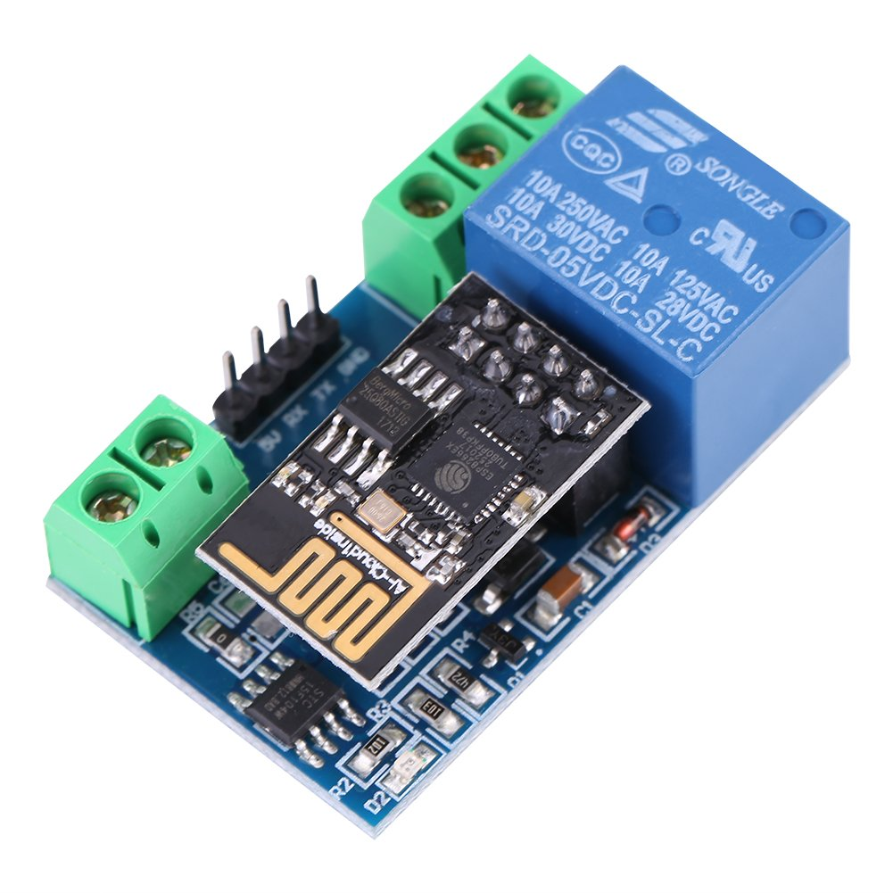
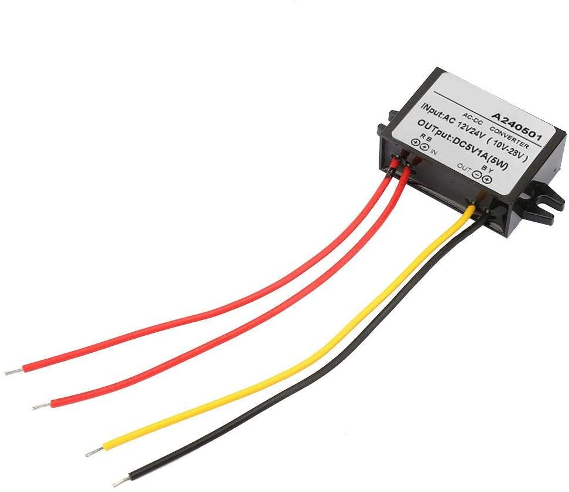
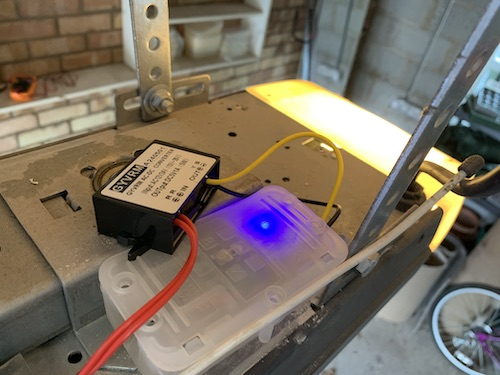

# Garage door – Redux

The door opener might be working, but it’s far from finished. Now that I’ve demonstrated that the concept works it’s time to revise the solution to make it far better.

## Can it be made smaller?

Yes. The Arduino Uno is a great first board for prototyping but the ESP8266 actually had it’s own microcontroller on board with 2 GPIO pins. I should therefore be able to just use this circuit.

I can even keep using the Arduino IDE but it needs to add some extra imports to support the ESP826 hardware.

1. In the Arduino IDE and click on **“File -> Preferences”.**
2. In  “Aditional Boards Manager URLs” add this line and click on “OK”: **“\*[http://arduino.esp8266.com/stable/package_esp8266com_index.json”](http://arduino.esp8266.com/stable/package_esp8266com_index.json")\***
3. Go to **“Tools -> Board -> Boards Manager”**, type “ESP8266” and install it.
4. Go again to **“Tools -> Board”** and select “Generic ESP8266 Module”.

I found out the hard way that there’s actually an issue with version 2.6.x, but this has been fixed with 2.7.1 which I’m currently using.

The next step is working out how to program the ESP8266. Unlike the Arduino it doesn’t have a simple USB programming interface, so instead I need to make use of USB TTL adapter to support serial communications. I used this FT232RL unit:


Wiring the TTL adapter to the ESP8266 isn’t as simple either. It first needs to be set to 3.3V via a jumper. Connecting the TTL to the ESP8266 is very similar to connecting to to an Arduino, with the extra caveat that to put the ESP8266 into programming mode the GPIO0 pin must be earthed during boot (and then removed after flashing to boot normally).

The pinouts are shown below:

```bash
ESP8266	| FTDI TTL
--------------------
    3V3 | VCC (3.3V) 
    RST |
     EN | VCC (3.3V)
     TX | RX
    GND | GND
  GPIO2 |
  GPIO0 | GND (during flash)
     RX | TX
```

Because some pins need doubling up and the ESP8266 is too small to be mounted on a breadboard, this is how it looks in practice.


My wiring skills have not improved.

## Can the relay board be made smaller?

Yes. As luck would have it you can buy a single relay shield designed to work with the ESP8266 directly. 



These are the ones I bought [[link](https://www.amazon.co.uk/dp/B078Q3D5MV/ref=cm_sw_em_r_mt_dp_U_JkPYEbENCSFQ7)]. It comes with a manual which explains how simple it is to control the really from the ESP8266.

```c
int relayPin = 2; // GPIO2 of ESP8266
pinMode(relayPin, OUTPUT); 
digitalWrite(relayPin, HIGH);
```

That is simple. Only problem is it doesn’t work. After a *lot* of reading of forums on the Internet I concluded that this code is nonsense, it doesn’t work on this board at all, a conclusion that many others have reached.

Looking on the developers own website ([http://www.chinalctech.com/xwzx/24.html ](http://www.chinalctech.com/xwzx/24.html)) gives completely different code for the same relay control.

```c
Serial.begin(9600);
var relayOn = [0xA0, 0x01, 0x01, 0xA2];
var relayOff = [0xA0, 0x01, 0x00, 0xA1];
Serial.write(relayOn, sizeof(relayOn));    
delay(2000);
Serial.write(relayOff, sizeof(relayOff));    
```

At least this code works. This means that separate to the programming setup I now have a second setup to test the ESP8266 in the Relay shield. For the time behind this can be powered by an Arduino Uno, a setup which looks like this.


That photo also shows how much smaller this circuit is when compared to an Arduino Uno, this has definitely been successful in shrinking the hardware. Now to improve the software…

## Can I improve the Wifi code?

Yes. By quite a lot it turns out. Rather than having to use AT commands to set up the WiFi, the ESP & Arduino communities have already created some very useful libraries:

- [ESP_WiFiManager](https://github.com/khoih-prog/ESP_WiFiManager)
- [ESP8266WiFi](https://arduino-esp8266.readthedocs.io/en/latest/esp8266wifi/readme.html)

Whilst The ESP8266WiFi library provides some simple commands to establish, modify and test the WiFi connection, ESP_WiFiManager includes a captive portal to allow a user to modify the WiFi settings if the device can’t find the previous AP. This is a very useful feature – my original code would require refreshing if the WiFi credentials changed, this now gives me a Web interface. If for whatever reason it cannot connect to the old WiFi it will launch it’s own AP with a name ESP-xxxxxx and give the user 30 seconds to connect and choose a visible AP. If WiFi problems occur the device will regularly reboot to attempt to re-establish connection.

To achieve all of this just requires two new functions. WiFiSetup() is called from Setup() and does al the credential recovery, connection establishment an initial testing. WiFiCheck() is called from the main loop and will reboot the device if it can’t find a WiFi AP after 30 seconds.

The ESP8266 board has a single LED on GPIO2, which can be controlled with GPIO commands:

```c
  pinMode(2, OUTPUT);
  digitalWrite(2, HIGH);
```

This LED will be used to reflect WiFi status. Note that HIGH disabled the LED, and LOW enables it. 

The code for these two functions is shown below:

```c
#include <ESP8266WiFi.h>
#include <DNSServer.h>
#include <ESP8266WebServer.h>
#include <ESP_WiFiManager.h>

// Saved SSID and PW for home WiFi
String Router_SSID;
String Router_Pass;

// Global variables used by WifiManager
String ssid = "ESP_" + String(ESP_getChipId(), HEX);
#define ESP_getChipId()   (ESP.getChipId())
#define WIFI_CONNECT_TIMEOUT        30000L
#define WHILE_LOOP_DELAY            1000L
#define WHILE_LOOP_STEPS            (WIFI_CONNECT_TIMEOUT / ( 3 * WHILE_LOOP_DELAY ))

void WiFiSetup() {
  Serial.println("Start WiFiSetup");
  
  unsigned long startedAt; // timer variable
  ESP_WiFiManager ESP_wifiManager("Gate ESP"); // WiFi manager
  Router_SSID = ESP_wifiManager.WiFi_SSID();         // esblish storage for creds
  Router_Pass = ESP_wifiManager.WiFi_Pass();
  Serial.println("Stored: SSID = [" + Router_SSID + "]");
  //ssid.toUpperCase();

  // Adding this line to force the configuration portal. suggest leaving it commented out
  //ESP_wifiManager.startConfigPortal((const char *) ssid.c_str());

  // If no creds in memory, start configuration portal to request some
  if (Router_SSID == "")
  {
    Serial.println("We haven't got any access point credentials, so get them now");
    if (!ESP_wifiManager.startConfigPortal((const char *) ssid.c_str()))
      Serial.println("Not connected to WiFi but continuing anyway.");
    else
      Serial.println("WiFi creds established");
  }

  // Start WiFi connection
  startedAt = millis();
   while ( (WiFi.status() != WL_CONNECTED) && (millis() - startedAt < WIFI_CONNECT_TIMEOUT ) )
  {
    // enable WiFi
    WiFi.mode(WIFI_STA);
    WiFi.persistent (true);
    WiFi.setAutoReconnect(true);
    WiFi.begin(Router_SSID.c_str(), Router_Pass.c_str());
    Serial.print("Connecting to " + String(Router_SSID) + ": ");

    int i = 0;
    while ((!WiFi.status() || WiFi.status() >= WL_DISCONNECTED) && i++ < WHILE_LOOP_STEPS)
    {
      Serial.print(String(WiFi.status()));
     digitalWrite(2, HIGH);

      delay(WHILE_LOOP_DELAY);
    }
    Serial.println();
  }

  
  Serial.println("WiFi Loop complete after " + String((millis() - startedAt) / 1000) + " seconds");

  if (WiFi.status() == WL_CONNECTED)
  {
    Serial.print("Connected. Local IP: ");
    Serial.println(WiFi.localIP());
    digitalWrite(2, LOW);
  }
  else 
  {
    Serial.println("Not Connected: " + String(ESP_wifiManager.getStatus(WiFi.status())));
    Serial.println("Reboot");
    ESP.restart();
  }
}


void WiFiCheck() {
  unsigned long startedAt; // timer variable
  // If WiFi isn't connected, display debug message
  if (WiFi.status() == WL_IDLE_STATUS) {
    Serial.println("WL_IDLE_STATUS");
  }
  else if (WiFi.status() == WL_NO_SSID_AVAIL) {
    Serial.println("WL_NO_SSID_AVAIL");
  }
  else if (WiFi.status() == WL_CONNECT_FAILED) {
    Serial.println("WL_CONNECT_FAILED");
  }
  else if (WiFi.status() == WL_CONNECTION_LOST) {
    Serial.println("WL_CONNECTION_LOST");
  }
  else if (WiFi.status() == WL_DISCONNECTED) {
    Serial.println("WL_DISCONNECTED");
  }

  
  startedAt = millis(); // spend 30 seconds trying to reconnect
  while (WiFi.status() != WL_CONNECTED && (millis() - startedAt < 30000 )) {
    digitalWrite(2, HIGH);
    Serial.println("Trying to reconnect WiFi");
    delay(1000);
  }
  if (WiFi.status() != WL_CONNECTED) { // if reconnection doesn't work, try a reboot.
    ESP.restart();
  } else {
    digitalWrite(2, LOW); // wifi is back
  }
}
```

## Can I move to the home DMZ?

Yes. Just to be awkward, my guest WiFi uses emoji. These don’t show up very well on the serial terminal so I have to give the SSID in unicode format.

🐿 is actually a chipmunk, not a squirrel but it looks good enough for me. It’s Unicode value is: U+1F43F, UTF-8: F0 9F 90 BF, which gives me the following code to connect the ESP to it:

```c
const char *ssid = "\xf0\x9f\x90\xbf";
```

But then mDNS doesn’t work (because my guest WiFi is in a completely different IP range), so I might not want to use that.

## Can I add DNS?

Yes, this turns out to be surprisingly easy, using the [ESP8266mDNS library](https://tttapa.github.io/ESP8266/Chap08 - mDNS.html). I can’t be bothered to modify the captive portal library to allow the user to set a name, so the DNS will use the MAC address previous used to name the AP during initial setup.

```c
#include <ESP8266mDNS.h> 
String ssid = "ESP_" + String(ESP_getChipId(), HEX);

void setup() {
 if (!MDNS.begin(ssid)) {
    Serial.println("Error setting up MDNS responder!");
  }
  Serial.println("mDNS responder started as: " + ssid + ".local");
}

void loop() {
  MDNS.update();
}
> ping ESP_754E3C.local  
PING esp_754e3c.local (10.0.42.229): 56 data bytes
64 bytes from 10.0.42.229: icmp_seq=0 ttl=255 time=434.528 ms
64 bytes from 10.0.42.229: icmp_seq=1 ttl=255 time=29.537 ms
64 bytes from 10.0.42.229: icmp_seq=2 ttl=255 time=11.969 ms
64 bytes from 10.0.42.229: icmp_seq=3 ttl=255 time=10.341 ms
64 bytes from 10.0.42.229: icmp_seq=4 ttl=255 time=10.534 ms
64 bytes from 10.0.42.229: icmp_seq=5 ttl=255 time=11.895 ms
```

However, what this doesn’t show is that it takes >4 seconds to resolve the DNS name. It seems mDNS isn’t overly compatible between different OSs. For the moment homebridge is running on a MacBook and this time delay upsets everything. 

## Can I improve the server code?

Yes please. Rather than handling queries and responses by hand, the [ESP8266WebServer](https://github.com/esp8266/Arduino/tree/master/libraries/ESP8266WebServer) library does this all for me with a few simple commands.

```c
#include <ESP8266WebServer.h>
ESP8266WebServer server(80);

void handleRoot() {
  server.send(200, "text/plain", "root");
}

void setup() {
  server.on("/", handleRoot); // call a function
  server.on("/inline", []() { // inline response
    server.send(200, "text/plain", "inline");
  });
 server.begin();
}

void loop(void) {
  server.handleClient();
}
```

For more advanced commands, see the GitHub page.

Rather than writing all this any hand, the homebridge plugin for a garage door opener comes with some[ example arduino code](https://github.com/Tommrodrigues/homebridge-http-garage/tree/master/examples). I will be making use of this to save time.

## Can I add TLS security?

Yes. Alongside the ESP8266WebServer library is ESP8266WebServerSecure. This adds one important function:

```
server.getServer().setServerKeyAndCert_P(rsakey, sizeof(rsakey), x509, sizeof(x509));
```

This needs an RSA key and X509 certificate which can be generated using [this script](https://github.com/esp8266/Arduino/blob/master/libraries/ESP8266WiFi/examples/WiFiHTTPSServer/make-self-signed-cert.sh). As I’m lazy these are going to be self-signed, and the same across all instances.

## Can I add authentication?

Yes. It’s a built in function with the web server library using the following code:

```c
server.authenticate(<username>, <password>)
```

It’s not that necessary as it’s only being used on an internal network, but for the sake of completion it makes sense to ensure that anyone else on the local network can’t affect the circuit even if they happen to guess the IP address and API.

## How does the source code look now?

Have a look in the [repo](mark2.ino).

## How does this integrate to Homebridge?

Update homebridge to use the latest version of the [garage door opener plugin](https://github.com/Tommrodrigues/homebridge-http-garage).

```json
 "accessories": [
        {
            "accessory": "GarageDoorOpener",
            "name": "Gate",
            "apiroute": "https://ESP_754e3c.local",
            "username": "admin",
            "password": "",
            "timeout": 10000
        }
```

The API is now assumed, so the configuration just needs the address of the ESP. The timeout has been added as the ESP isn’t very fast to respond.

## Can I use local power sources?

Yes. When this project started I noted that both the garage door opener and gate had a local 24V AC power source on the interface pins, presumably to connect peripherals. Unfortunately my add-ons use 5V DC. Enter the buck converter!



These are available from [Amazon](https://www.amazon.co.uk/gp/product/B07WJJQRQ1/ref=ppx_yo_dt_b_asin_title_o05_s00) and seem too good (cheap) to be true, but they actually work inline.

## Can I deploy 3 instances?

Yes. First thing I notice is that I have to re-enable the captive portal line in the code to give it some WiFi creds. The chip already had the guest wifi credentials from a previous experiment so I had to force the captive portal in the code, a completely new chip will trigger the portal when it sees there is no creds in memory.

I also notice that the ESPs that came with the relay crash when I flash them. This could be an issue with my code, or them having the wrong OS flashed, or possibly just a different serial baud. For now I have enough working ESPs for this not to matter, but I will have to investigate the chip differences when I start to use them for my next project (TBD).

## Does it work?

Yes! This it what it looks like deployed. Annoying the connection box was just too small to cram in the ESP and the buck converter so it’s not as tidy as I’d have hoped but at least it’s safe. The blue LED on the ESP glows through the box nicely and the code uses this to indicate activity and/or WiFi issues.



And the obligatory video of it actually working?

<video controls="" src="images/gatevid.mp4" style="-webkit-user-select: none !important; box-sizing: inherit; display: inline-block; height: auto; max-width: 100%;"></video>

## Future Plans

- revisit the mdns vs guest wifi decision.
- Edit code to ensure status is remembered across ESP reboots.
- Edit WifiSetup / WiFiCheck to open captive portal on boot, not if WiFi just disappears.

These are for another day…